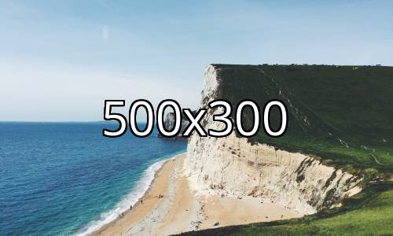

# Dimension Watermark

Automatically add text to an image showing the dimensions.


## Overview

It is common when using placeholder images to show the images dimensions in the center of the image.
This library is a [Glide](https://github.com/thephpleague/glide) manipulator which will do this and automatically
adjust text size. 




*Photo by [Robert Bye](https://unsplash.com/es/@robertbye) on [Unsplash](https://unsplash.com/s/photos/dorset)*


## Installation

```
composer require freshleafmedia/glide-dimension-watermark
```


## Usage

```php
use Freshleafmedia\DimensionWatermark\DimensionWatermark;

// Setup Glide server. See https://glide.thephpleague.com/2.0/simple-example/
$server = League\Glide\ServerFactory::create([
    // ...
]);


// Add DimensionWatermark to the manipulators array
$manipulators = $api->getManipulators();

array_splice($manipulators, count($manipulators) - 1, 0, [new DimensionWatermark()]);

$api->setManipulators($manipulators);
```

Note: It is important that `DimensionWatermark` is added after the [`Size`](https://glide.thephpleague.com/2.0/api/size/) manipulator and before [`Encode`](https://glide.thephpleague.com/2.0/api/encode/) manipulator


## License

See [LICENSE](LICENSE)
